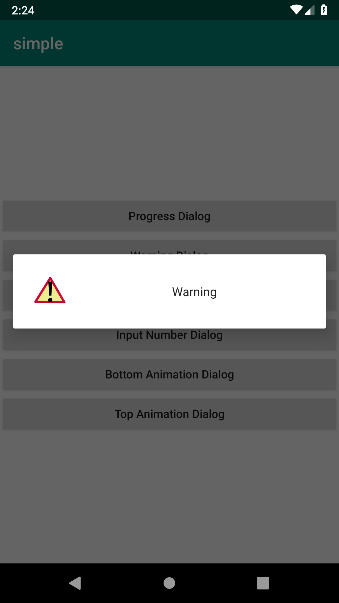
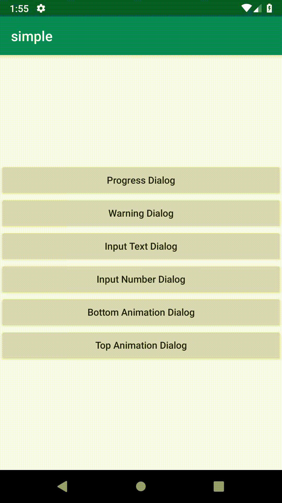

# android-fast-dialog
Android Fast Dialog 

Provides you easily create various pop-up dialogs that you can use.

[](https://jitpack.io/#eneskarpuzoglu/android-fast-dialog)

## Installation

### Step 1. Add the JitPack repository to your build file

- **Add it in your root build.gradle at the end of repositories:**

```gradle
	allprojects {
		repositories {
			...
			maven { url 'https://jitpack.io' }
		}
	}
```
### Step 2. Add the dependency

```gradle
	dependencies {
	    implementation 'com.github.eneskarpuzoglu:android-fast-dialog:($LastVersion)'
	}
```

## How to use

> Create `FastDialog` use to `FastDialogBuilder`
```java
	FastDialog dialog = new FastDialogBuilder(this)
```
> Functions
```java
	 progressDialog(String progressString) // sets the fast-dialog as a progress dialog
	 setTitle(String title) // set fast-dialog title
	 withIcon() // set visible to ImageView gif on fast-dialog
	 setText(String text) // set fast-dialog TextView
	 setHint(String hint) // set fast-dialog EditText's hint
	 negativeText(String negative) // set negative button on fast-dialog and set button text
	 possitiveText(String possitive) // set possitive button on fast-dialog and set button text
	 cancelable(boolean bool) // set cancelable to fast-dialog
	 decimalEditText(boolean bool) // set EditText to decimalEditText
	 possitiveClickListener(PossitiveClick click) // set listener to possitive button
	 negativeClickListener(NegativeClick click) // set listener to negative button
	 changeColor(int colorButtonsAndTitle,int colorButtonsAndTitleText,int colorPrimaryText) // change fast-dialog colors
		//Animations
	 setAnimation(Animations animation)
		// Animations.SLIDE_LEFT
		// Animations.SLIDE_RIGHT
		// Animations.SLIDE_TOP
		// Animations.SLIDE_BOTTOM
		// Animations.FADE_IN
		// Animations.GROW_IN
		
		//Positions
	setPosition(Positions position)
		// Positions.CENTER
		// Positions.LEFT
		// Positions.RIGHT
		// Positions.TOP
		// Positions.BOTTOM
	 create() // create fast-dialog
```

## Examples
> Simple Progress Dialog
```java
	FastDialog dialog = new FastDialogBuilder(this)
			.progressDialog("Please Wait!").create();
	dialog.show();
```


>  Warning Dialog
```java
	FastDialog dialog = new FastDialogBuilder(this)
			.setText("Warning")
			.withIcon()
			.create();
	dialog.show();
```


>  Warning Dialog position center, grown in animation and changed colors
```java
	FastDialog dialog = new FastDialogBuilder(this)
                .setTitle("Warning")
                .setText("Warning Text")
                .changeColor(ContextCompat.getColor(getApplicationContext(),R.color.colorAccent),
                        ContextCompat.getColor(getApplicationContext(),R.color.colorSecondaryText),
                        ContextCompat.getColor(getApplicationContext(),R.color.colorPrimaryText))
                .setHint("please enter text")
                .setAnimation(Animations.GROW_IN)
                .negativeText("Cancel")
                .create();
        dialog.show();
```


>  Warning Dialog position bottom, slide bottom animation and listener possitive button
```java
	FastDialog dialog = new FastDialogBuilder(this)
                .setTitle("Warning")
                .setText("Warning Text")
                .possitiveText("Ok")
                .negativeText("Cancel")
                .withIcon()
                .setAnimation(Animations.SLIDE_BOTTOM)
                .setPosition(Positions.BOTTOM)
                .possitiveClickListener(new PossitiveClick() {
                    @Override
                    public void onClick(View view) {
                        Toast.makeText(MainActivity.this,"Ok Pressed",Toast.LENGTH_SHORT).show();
                        dialog.dismiss();
                    }
                })
                .create();
        dialog.show();
```


## License

- Copyright 2018 © Enes Karpuzoğlu.

Licensed under the Apache License, Version 2.0 (the "License");
you may not use this file except in compliance with the License.
You may obtain a copy of the License at

   http://www.apache.org/licenses/LICENSE-2.0

Unless required by applicable law or agreed to in writing, software
distributed under the License is distributed on an "AS IS" BASIS,
WITHOUT WARRANTIES OR CONDITIONS OF ANY KIND, either express or implied.
See the License for the specific language governing permissions and
limitations under the License.


