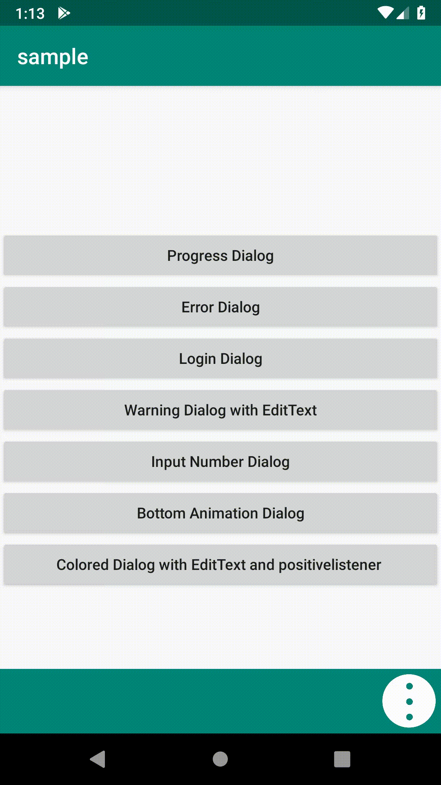
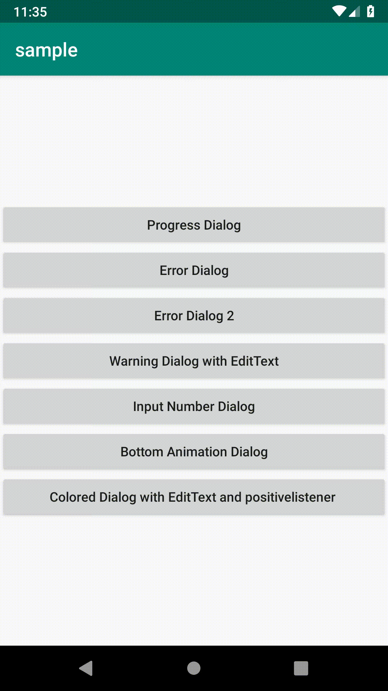
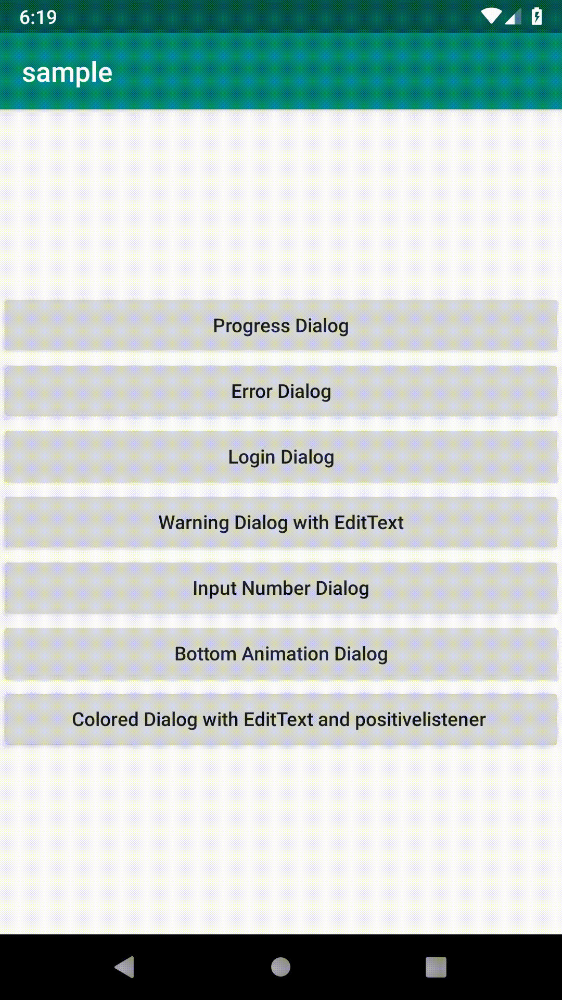
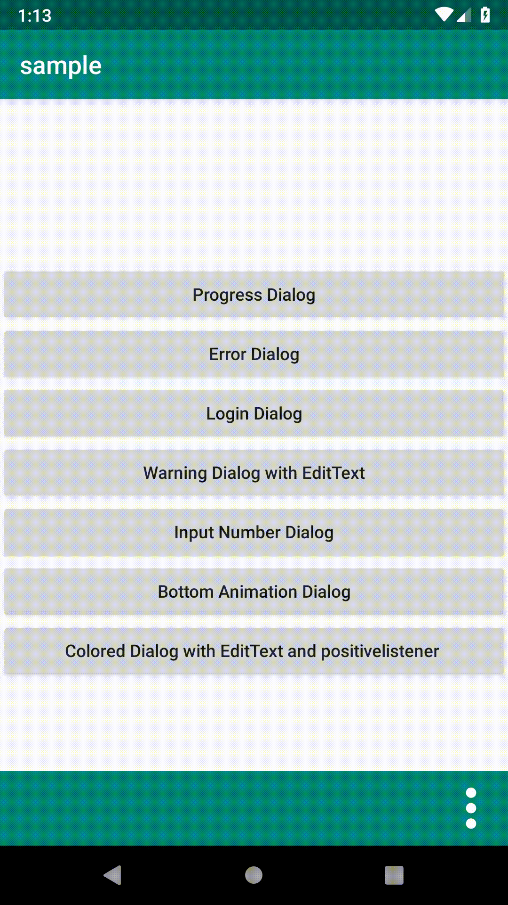

# android-fast-dialog
Android Fast Dialog 

Provides you easily create various pop-up dialogs that you can use.

[](https://jitpack.io/#eneskarpuzoglu/android-fast-dialog)

## Installation

### Step 1. Add the JitPack repository to your build file

- **Add it in your root build.gradle at the end of repositories:**

```gradle
	allprojects {
		repositories {
			...
			maven { url 'https://jitpack.io' }
		}
	}
```
### Step 2. Add the dependency

```gradle
	dependencies {
	    implementation 'com.github.eneskarpuzoglu:android-fast-dialog:($LastVersion)'
	}
```

## How to use

> Create `FastDialog` use to `FastDialogBuilder`
```java
	FastDialog dialog = new FastDialogBuilder(Context contex,Type type)
```
> FastDialogBuilder Functions
```java
	 progressText(String progressString) // sets progress dialog text
	 setTitleText(String title) // set fast-dialog title
	 hideTitle() //hide title
	 hideIcon() // hide to ImageView gif on fast-dialog
	 setText(String text) // set fast-dialog TextView
	 setHint(String hint) // set fast-dialog EditText's hint
	 negativeText(String negative) // set negative button on fast-dialog and set button text
	 positiveText(String positive) // set positive button on fast-dialog and set button text
	 cancelable(boolean bool) // set cancelable to fast-dialog
	 decimalEditText() // set EditText to decimalEditText
	 setTextMaxLenght(int lenght) // set EditText max lenght
	 setFullScreen(boolean bool) // set fullscreen to dialog window. default true
	 changeColor(int colorButtonsAndTitle,int colorButtonsAndTitleText,int colorPrimaryText) // change fast-dialog colors
     setInputText(String str) // set EditText input
	 privateEditText() // set the edittext type to password
		//Animations
	 setAnimation(Animations animation)
		// Animations.SLIDE_LEFT
		// Animations.SLIDE_RIGHT
		// Animations.SLIDE_TOP
		// Animations.SLIDE_BOTTOM
		// Animations.FADE_IN
		// Animations.GROW_IN
		
		//Positions
	setPosition(Positions position)
		// Positions.CENTER
		// Positions.LEFT
		// Positions.RIGHT
		// Positions.TOP
		// Positions.BOTTOM
	 create() // create fast-dialog
```

> FastDialog Functions

```java
	i(this) // create information dialog
	e(this) // create error dialog
	w(this) // create warning dialog
	d(this) // create normal dialog
	p(this) // create progress dialog
	l(this) // create login dialog
	positiveClickListener(PositiveClick click) // set listener to positive button
	negativeClickListener(NegativeClick click) // set listener to negative button	
	dismissListener(DismissListener dismissListener) // set dismiss listener to fast-dialog
	isShowing() // return is fast-dialog showing
	show() //show dialog
	dismiss() //dismiss dialog
	getInputText() // get dialog EditText's text
	getUsernameOrEmail() //get Username or Email from login dialog
	getPassword() // get Password from login dialog
	setProgressText(String str) // set Progress dialog text
	 
```
## Examples
> Simple Progress Dialog
```java
	 FastDialog.p(this).progressText("Please Wait!").create().show();
```


>  Simple Error Dialog
```java
	FastDialog.e(this)
                .setText("Error Dialog")
                .hideTitle()
                .create()
                .show();
```


>  Login Dialog
```java
	FastDialog dialog = new FastDialogBuilder(this,Type.LOGIN)
                //.loginWithEmail()
                .setTitleText("Login")
                .create();
        dialog.positiveClickListener(new PositiveClick() {
            @Override
            public void onClick(View view) {
                String string = dialog.getUsernameOrEmail() +" - "+dialog.getPassword();
                Toast.makeText(MainActivity.this,string,Toast.LENGTH_SHORT).show();
            }
        });
        dialog.show();
```


>  Warning Dialog position center, grown in animation with EditText
```java
        FastDialog.w(this)
                .setTitleText("Warning")
                .setText("Warning Text")
                .setHint("please enter text")
                .privateEditText()
                .setAnimation(Animations.GROW_IN)
                .positiveText("Accept")
                .create()
                .show();
```


>  Normal Dialog position center, fade in animation with DecimalEditText
```java
		FastDialog.d(this)
                .setTitleText("Dialog")
                .setText("Dialog Text")
                .setHint("please enter number")
                .decimalEditText()
                .setAnimation(Animations.FADE_IN)
                .positiveText("Ok")
                .negativeText("Cancel")
                .setInputText("55")
                .setTextMaxLenght(16)
                .cancelable(false)
                .create()
                .show();
```


>  Information Dialog position bottom, slide bottom animation and listener positive button and dismiss listener
```java
	FastDialog dialog = new FastDialogBuilder(this,Type.INFO)
                .setTitleText("Information")
                .setText("Information Text")
                .positiveText("Ok")
                .setAnimation(Animations.SLIDE_BOTTOM)
                .setPosition(Positions.BOTTOM)
                .create();
        dialog.positiveClickListener(new PositiveClick() {
            @Override
            public void onClick(View view) {
                Toast.makeText(MainActivity.this,"Ok Pressed",Toast.LENGTH_SHORT).show();
                dialog.dismiss();
            }
        });
        dialog.dismissListener(new DismissListener() {
            @Override
            public void onDismiss(DialogInterface dialog) {
                FastDialog.i(MainActivity.this).setText("Closed").hideTitle().create().show();
            }
        });
        dialog.show();
```


>  Warning Colored Dialog position top, slide top animation and listener positive button
```java
	FastDialog dialog= new FastDialogBuilder(this,Type.DIALOG)
                .setTitleText("Warning")
                .setText("Warning Text")
                .positiveText("Ok")
                .negativeText("Cancel")
                .changeColor(ContextCompat.getColor(getApplicationContext(),R.color.different),
                        ContextCompat.getColor(getApplicationContext(),R.color.text2),
                        ContextCompat.getColor(getApplicationContext(),R.color.text))
                .setHint("please enter your name")
                .setAnimation(Animations.SLIDE_TOP)
                .setPosition(Positions.TOP)
                .create();
        dialog.positiveClickListener(new PositiveClick() {
            @Override
            public void onClick(View view) {
                dialog.dismiss();
                Toast.makeText(MainActivity.this,dialog.getInputText().equals("")?"EditText is Empty":dialog.getInputText(),Toast.LENGTH_SHORT).show();
            }
        });
        dialog.show();
```


## License

- Copyright 2018 © Enes Karpuzoğlu.

Licensed under the Apache License, Version 2.0 (the "License");
you may not use this file except in compliance with the License.
You may obtain a copy of the License at

   http://www.apache.org/licenses/LICENSE-2.0

Unless required by applicable law or agreed to in writing, software
distributed under the License is distributed on an "AS IS" BASIS,
WITHOUT WARRANTIES OR CONDITIONS OF ANY KIND, either express or implied.
See the License for the specific language governing permissions and
limitations under the License.


